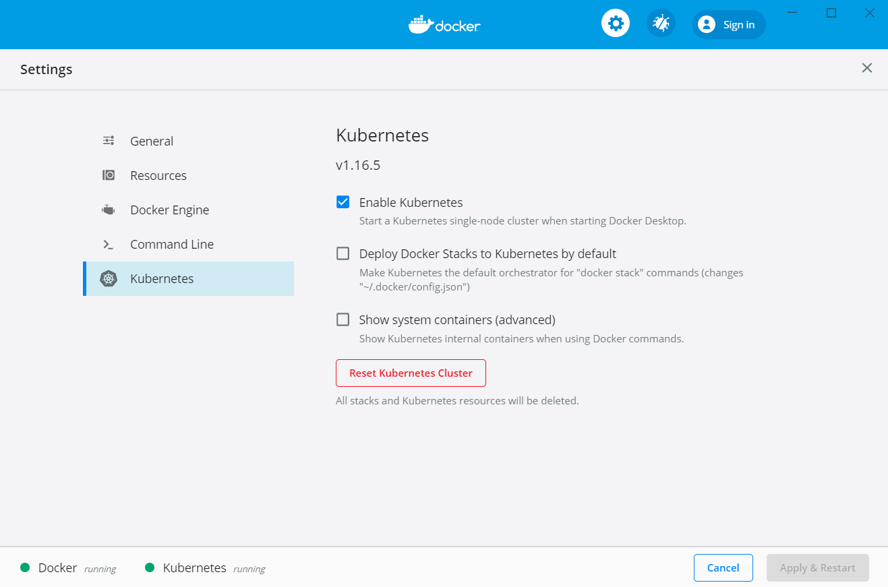

由于 Kubernetes 大量的镜像在 gcr.io ，国内无法稳定访问。解决方法分下面几步。

1. 下载 Docker for Windows， 安装。
2. 克隆阿里云提供的仓库，这个仓库主要是帮助从阿里云下载 Kubernetes 的镜像。git clone git@github.com:AliyunContainerService/k8s-for-docker-desktop.git 
3. 执行 ./load_images.sh，待下载完镜像。
4. 由 Docker 界面启动 Kubernetes。

